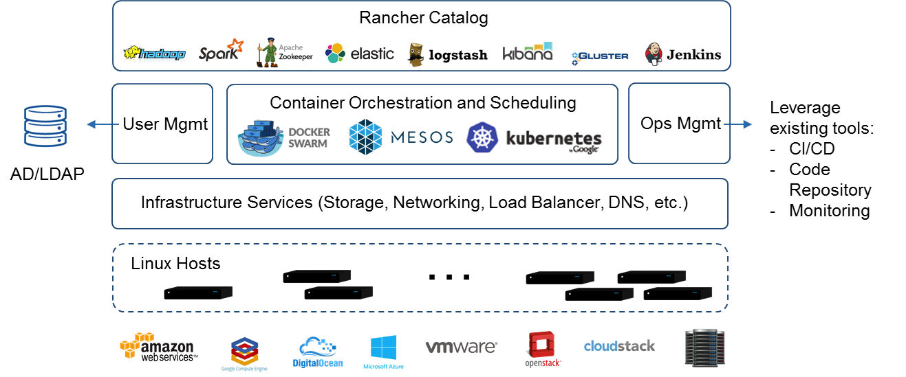
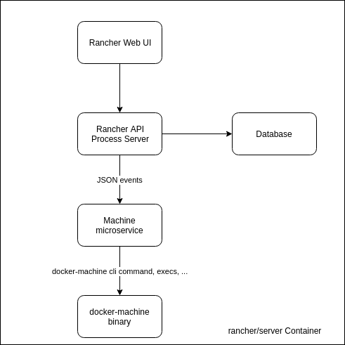
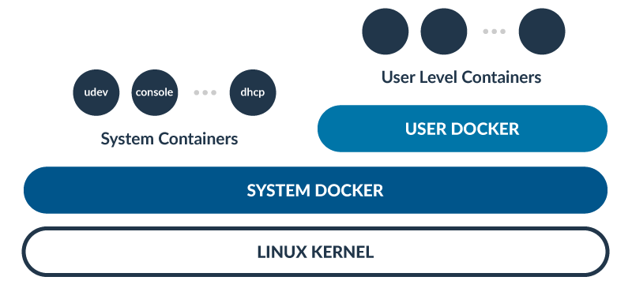
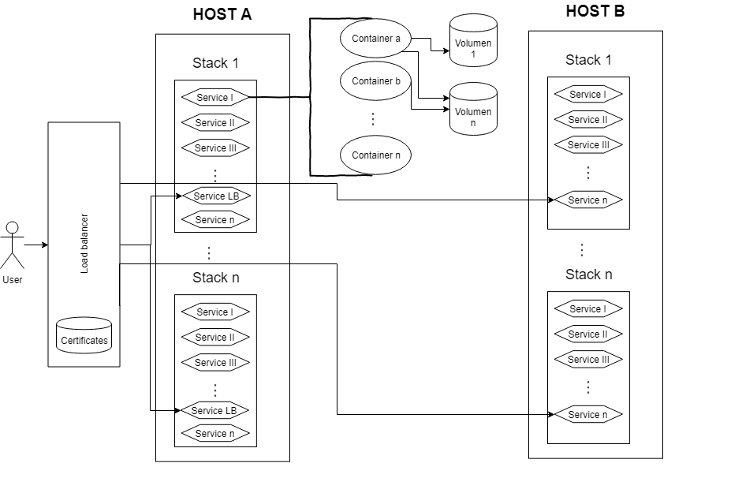

title: Rancher
class: animation-fade
layout: true

<!-- This slide will serve as the base layout for all your slides -->
.bottom-bar[
  {{title}}
]

---

class: impact

# {{title}}
## Complete container management platform

---

# The basics

## Overview

Rancher is an open source software platform that enables organizations to run and manage Docker in production.

Rancher supplies the entire software stack needed to manage containers in production.

Rancher software consists of four major components:

---

# The basics

## Infrastructure Orchestration

Rancher takes in raw computing resources from any public or private cloud in the form of *Linux hosts*.
Each Linux host can be a virtual machine or physical machine. 

Rancher implements a portable layer of infrastructure services designed specifically to power containerized applications.

Rancher infrastructure services include **networking**, **storage**, **load balancer**, **DNS**, and **security**.

Rancher infrastructure services are typically deployed as containers themselves, so that the same Rancher infrastructure service can run on any Linux hosts from any cloud.

---

# The basics

## Container Orchestration and Scheduling

Rancher includes a distribution of all popular container orchestration and scheduling frameworks today, including *Docker Swarm*, *Kubernetes* and *Mesos*.
The same user can create multiple Swarm or Kubernetes clusters.
They can then use the native Swarm or Kubernetes tools to manage their applications.

In addition Rancher supports its own container orchestration and scheduling framework called **Cattle**.

Cattle is used extensively by Rancher to orchestrate infrastructure services as well as setting up, managing, and upgrading Swarm, Kubernetes, and Mesos clusters.

---

# The basics

## Application Catalog

Rancher users can deploy an entire multi-container clustered application from the application catalog with one click of a button.

Users can manage the deployed applications and perform fully automated upgrades when new versions of the application become available.

Rancher maintains a public catalog consisting of popular applications contributed by the Rancher community.

Rancher users can create their own private catalogs.

---

# The basics

## Enterprise-grade Control

Rancher supports flexible user authentication plugins and comes with pre-built user authentication integration with *Active Directory*, *LDAP*, and *GitHub*.

Rancher supports Role-Based Access Control (RBAC) at the level of environments, allowing users and groups to share or deny access to, for example, development and production environments.

The following figure illustrates Rancher’s major components and features.

---

# The basics

.responsive[]

---

# Rancher Architecture

.col-6[
In Rancher, everything (containers, networks or images) is an API resource with a process lifecycle.

Rancher is built on the top of containers:

- A web UI
- An API
- A server that manage *Rancher Agents*
- A database
- A machine microservice
- The docker-machine binary
]

.col-6[.space-left[]]

---

# Rancher Architecture

When you run Rancher using `docker run rancher/server` the *Rancher API* + *Rancher Process Server* + *The Database* + *Machine Microservice* are processes that live inside this container.

--

The docker-machine binary is also living in the same container but only runs when it is called by the API.

--

Rancher has also an **Agent** part that manage the life cycle of containers.

--

If *docker-machine* creates a machine successfully, some events are exchanged between the docker-machine and the microservice.
A bootstrap event is created and a docker-machine config command is executed to get the details needed to connect to the machine’s Docker daemon.

---

# Rancher Architecture

If everything run without problems, the service fires up a **Rancher Agent** on the machine via docker

--

Rancher Agents open a WebSocket connection to the server in order to establish a 2-way communication.

--

The Rancher Agent manage its containers and reports every change using the Docker API.

---

# RancherOS

RancherOS is a small distribution released by Rancher team.

It is an easy way to run containers at scale in production, and includes only the services needed to run Docker.

It only includes the latest version of Docker and removes any unneeded library that a “normal” Linux distribution could have.

In RancherOS, everything is a container, the traditional init system is replaced so that Docker run directly on the Kernel.

A special component in this system is called **User Docker** which is the daemon that allow a user (a non-system user) runs its containers.

---

# RancherOS



---

# Rancher Server

[https://rancher.com/docs/rancher/v1.6/en/installing-rancher/installing-server/](https://rancher.com/docs/rancher/v1.6/en/installing-rancher/installing-server/)

First you need to install docker. Then you could run rancher server using: 

```bash
docker run -d --restart=unless-stopped -p 8080:8080 rancher/server
```

---

# Rancher UI

The UI and API will be available on the exposed port *8080*.
After the docker image is downloaded, it will take a minute or two before Rancher has successfully started and is available to view.

Navigate to the following URL: `http://<SERVER_IP>:8080`

Once the UI is up and running, you can start by adding hosts or select a container orchestration from the Infrastructure catalog.

By default, if a different container orchestration type is not selected, the environment will be using **Cattle**.

After the hosts are added into Rancher, you can start adding services or launch templates from the Rancher catalog.

---

# Cattle

## Services

Cattle adopts the standard Docker Compose terminology for services and defines a basic service as one or more containers created from the same Docker image.

Benefits of creating a service under Rancher include:
- *Service High Availability (HA)*: Rancher constantly monitors the state of your containers within a service and actively manages to ensure the desired scale of the service.
- *Health Monitoring*: Rancher implements a health monitoring system by running a healthcheck infrastructure service across its hosts to coordinate the distributed health checking of containers and services.

---

# Cattle

## Sidekick Services

Rancher supports the collocation, scheduling, and lock step scaling of a set of services by allowing users to group these services by using the notion of sidekicks. A service with one or more sidekicks is typically created to support shared volumes.

---

# Cattle

## Stacks

A stack is a group of services.

Stacks can be used to group together services that together implement an application.


---

# Environments

Rancher supports grouping resources into multiple environments.

Each environment starts with a set of infrastructure services defined by the environment template used to create the environment.

Each environment has its own set of resources, and is owned by one or more users or groups (ex: dev, prod).

All hosts and any Rancher resources, such as containers, infrastructure services, and so on are created in and belong to an environment.

---

# Hosts

Hosts are the most basic unit of resource within Rancher and is represented as any Linux server, virtual or physical

## How do hosts work?

A host gets connected to Rancher server when the Rancher agent container is started on the host.

Upon connection, it generates an agent account and API key pair in Rancher server.

The key pair is then used for all subsequent communication using the same authentication and authorization logic as there is for other kinds of accounts, like environment API keys.

---

# Hosts

## How do hosts work?

The design is that the agent is untrusted because it is running on the outside and potentially hostile (to the server) hardware.

The agent accounts have access to only the resources they need in the API, replies to events are checked that the event was actually sent to that agent, etc.

The registration token is per environment. It is generated on the server, stored in the database, and sent to the host as part of the agent registration with the API key pair.

The connections are point to point between hosts and AES encrypted, which is accelerated by most modern CPUs.

---

# Networking

Rancher implements a *CNI* (Container Network Interface) framework, which provides the ability to select different network drivers within Rancher.

To leverage the CNI framework, an environment is required to use the Network Services infrastructure service deployed.

These services host internal DNS server and manage routing to published ports on the host (via iptables).

Hosts have enabled IPsec network driver to create a simple and secure overlay network using IPsec tunneling.

---

# Load Balancer

A load balancer can be used to distribute network and application traffic to individual containers by adding rules to target services.

By default, Rancher has provided a managed load balancer using HAProxy that can be manually scaled to multiple hosts.

---

# DNS Service

Rancher provides an infrastructure service for a distributed DNS service by using its own lightweight DNS server coupled with a highly available control plane.

Each healthy container is automatically added to the DNS service when linked to another service or added to a Service Alias.

When queried by the service name, the DNS service returns a randomized list of IP addresses of the healthy containers implementing that service.

---

# DNS Service

- By default, all services within the same stack are added to the DNS service without requiring explicit service links, which can be set under Service Links in a service.
- You can resolve containers within the same stacks by the service names.
- If you need a custom DNS name for your service, that is different from your service name, you will be required to set a link to get the custom DNS name.
- Links are still required if a Service Alias is used.
- To make services resolvable that are in different stacks, you can use <service_name>.<stack_name> and are not required explicit links, which can be set under Service Links in a service.

---

# Diagram

.contain[]

---

# Documentation

- [https://rancher.com/docs/rancher/v1.6/en/](https://rancher.com/docs/rancher/v1.6/en/)
- [https://rancher.com/docs/os/v1.x/en/quick-start-guide/](https://rancher.com/docs/os/v1.x/en/quick-start-guide/)
- [https://rancher.com/docs/rancher/v2.x/en/quick-start-guide/deployment/quickstart-manual-setup/](https://rancher.com/docs/rancher/v2.x/en/quick-start-guide/deployment/quickstart-manual-setup/) (kubernetes)

---

# Demo time

- Deploy wordpress and configure hosts to access using personal hostname
- Create a new project in gitlab
- Add gitlab runner in Rancher
- Build docker image and push to gitlab registry using gitlab-ci
- Add gitlab registry to rancher
- Deploy built image to rancher
- Publish website
- Add auto sign certificates to website
- Escalate
- Auto deploy using Rancher API (continuous deployment)
